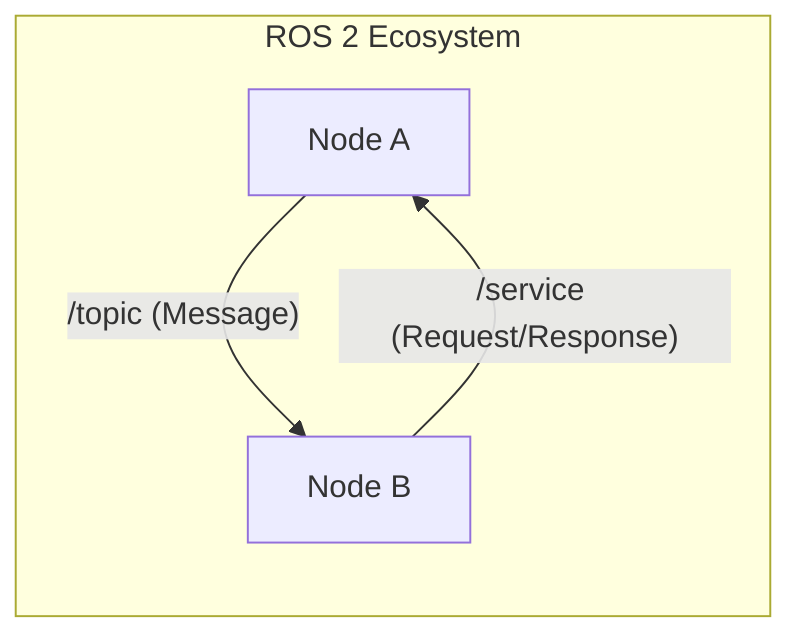
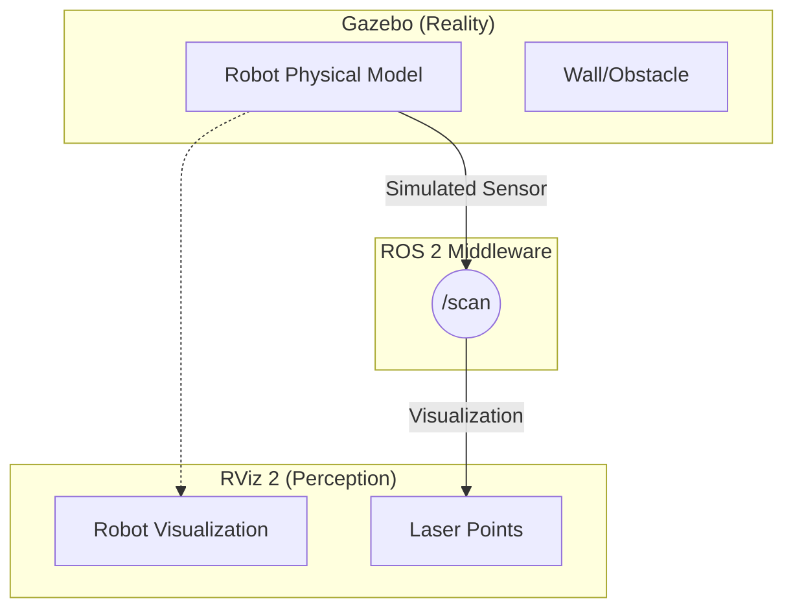

# フェーズ1：環境構築と基礎確認

## 1. 説明資料

### ROS 2 の基本アーキテクチャ
ROS 2は、複数の「ノード」が「トピック」を介して通信する分散システムです。



### RViz 2 と Gazebo の役割
学習において最も重要なのは、**「何を見ているか」**の区別です。

| ツール | 役割 | 世界観 |
| :--- | :--- | :--- |
| **RViz 2** | 可視化 (Visualization) | **ロボットの頭の中**（センサー値、推定自己位置など） |
| **Gazebo** | シミュレーション (Simulation) | **現実（仮想）の世界**（物理法則、物体の実体） |



---

## 2. 手を動かす内容

### ステップ1: ワークスペースの作成
コンテナ内でROS 2のワークスペースを作成し、ビルドを確認します。

```bash
mkdir -p ~/ros2_ws/src
cd ~/ros2_ws
colcon build
source install/setup.bash
```

### ステップ2: GUIの起動確認
RViz 2 と Gazebo が正しく表示されるか確認します。

1. **RViz 2 の起動**:
   ```bash
   rviz2
   ```
2. **Gazebo の起動**:
   ```bash
   gz sim empty.sdf
   ```

---

## 3. 作成したものの期待値

- [ ] **コマンドライン**: `ros2 node list` や `ros2 topic list` がエラーなく動作する。
- [ ] **RViz 2**: 黒い画面（またはグリッド）が表示されたウィンドウが立ち上がる。
- [ ] **Gazebo**: 3Dのグリッド面が表示されたシミュレータが立ち上がる。

> [!TIP]
> GUIが表示されない場合は、WSLgの設定やブラウザベースのVNC接続を確認してください。
