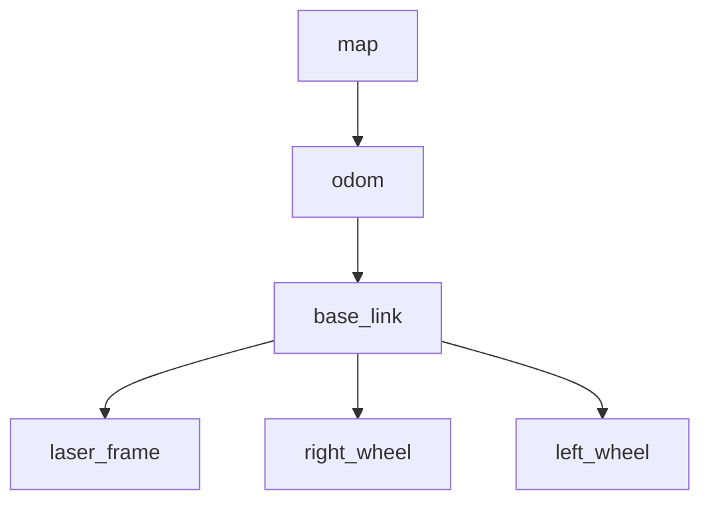

# フェーズ2：RViz 2 深掘り - 「ロボットの頭の中を見る」

## 1. 説明資料

### TF (Transform) とは？
ロボットには、手、足、カメラ、LiDARなど多くの部品があります。各部品が「今どこにあるか」を管理するための仕組みが **TF (座標変換)** です。



### なぜ座標系が必要か
「センサーが壁を3m先に見つけた」としても、そのセンサー自体が「ロボットの右側 10cm」に付いているのか「左側 10cm」にあるのかで、ロボット全体から見た壁の位置は変わります。

---

## 2. 手を動かす内容

### ステップ1: 静的な座標配信
物理的なロボットがなくても、コマンドで座標系を定義できます。

```bash
# base_link から見て、x方向に1.0m離れた位置に laser_frame を定義
ros2 run tf2_ros static_transform_publisher --x 1.0 --y 0 --z 0 --yaw 0 --pitch 0 --roll 0 --frame-id base_link --child-frame-id laser_frame
```

### ステップ2: RViz 2 での確認
1. RViz 2 を起動し、左下の **[Add]** ボタンから **[TF]** を追加します。
2. **Global Options** の **Fixed Frame** を `base_link` に変更します。

---

## 3. 作成したものの期待値

- [ ] **TFTree**: RViz上で `base_link` と `laser_frame` の2つの座標軸（赤・緑・青のベクトル）が表示される。
- [ ] **親子関係**: 親（base_link）を動かすと、子（laser_frame）も相対位置を保って動く（GUI上で確認）。

> [!IMPORTANT]
> RViz上の表示が「切れている（Status: Error）」場合は、Fixed Frame の設定が正しいか、TFノードが実行中かを確認してください。
