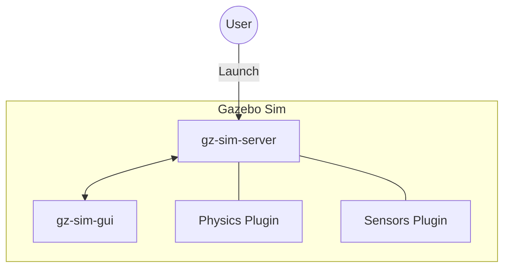

# フェーズ3：Gazebo 深掘り - 「仮想の物理世界を作る」

## 1. 説明資料

### Gazebo Sim のアーキテクチャ
Gazebo Sim（旧称 Ignition Gazebo）は、複数のプラグインが協調して動作するシステムです。



### SDF vs URDF
- **SDF (Simulation Description Format)**: Gazebo専用。センサー、物理挙動、世界の環境（太陽、影、摩擦）を詳しく記述できる。
- **URDF (Unified Robot Description Format)**: ROS標準。ロボットのリンク構成などは得意だが、世界の記述はできない。

---

## 2. 手を動かす内容

### ステップ1: シンプルなワールドの起動
障害物のあるワールドを起動してみます。

```bash
# シェイパーがあるワールドを起動
gz sim -r shapes.sdf
```

### ステップ2: モデルの挿入
1. 左側のパネルから **[Entity Tree]** や **[Resource Spawner]** を使って、立方体や球体を配置します。
2. タイムライン上の **[Play]** ボタンを押し、重力によって物体が落ちる様子を確認します。

---

## 3. 作成したものの期待値

- [ ] **物理挙動**: 配置した物体が地面に落ち、壁にぶつかってもめり込まない。
- [ ] **表示**: 3Dビューポートで自由な視点操作（回転・移動）ができる。

> [!NOTE]
> Gazebo Sim では、シミュレーションが **[Paused]** 状態だと物体は動きません。必ず再生ボタンを押してください。
