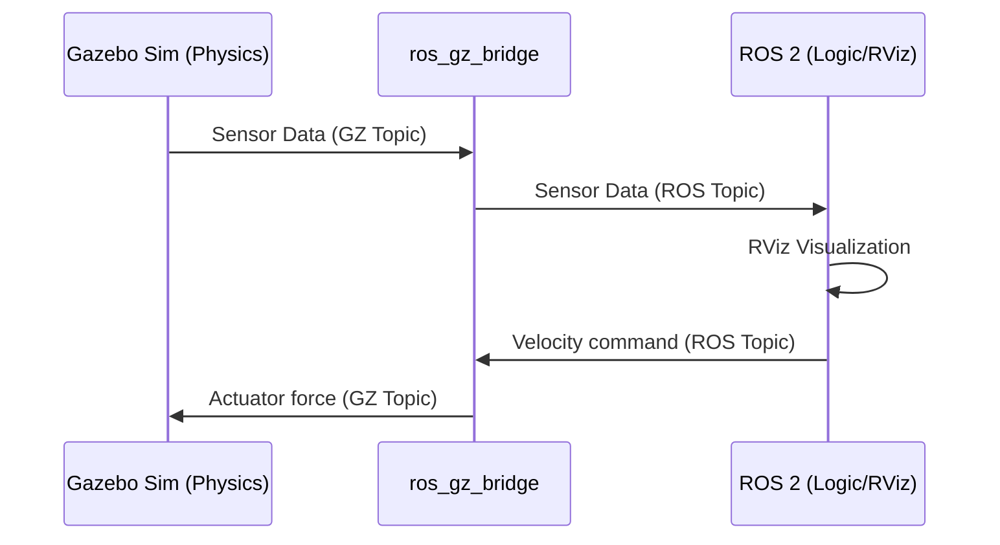

# フェーズ4：連携の理解 - 「シミュレーションと可視化の融合」

## 1. 説明資料

### ros_gz_bridge の必要性
Gazebo Sim と ROS 2 は、それぞれ独自の通信システムを持っています。これらを繋ぐ「通訳者」が `ros_gz_bridge` です。



---

## 2. 手を動かす内容

### ステップ1: LiDAR搭載モデルの起動
LiDARが搭載されたサンプルワールドを起動します。

```bash
gz sim sensors_demo.sdf
```

### ステップ2: ブリッジの構築
Gazebo上のLiDARデータを、ROS 2の `LaserScan` 型として受け取れるようにします。

```bash
ros2 run ros_gz_bridge parameter_bridge /lidar@sensor_msgs/msg/LaserScan@gz.msgs.LaserScan
```

### ステップ3: RViz 2 での可視化
1. RViz 2 を起動し、**[Add]** から **[LaserScan]** を追加します。
2. Topic に `/lidar` を指定します。

---

## 3. 作成したものの期待値

- [ ] **リアルタイム性**: Gazebo内でロボットを動かすと、RViz上の点群（赤い点など）が遅延なく連動して動く。
- [ ] **一貫性**: Gazeboで目の前に壁があるなら、RVizでも同じ位置に点が表示されている。

> [!CAUTION]
> 座標系 (Fixed Frame) の設定を誤ると、点群が表示されません。`/lidar` トピックのデータが持つフレーム名を確認してください。
