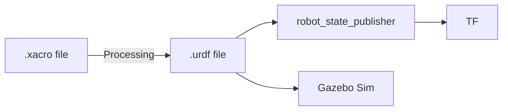

# フェーズ5：実践プロジェクト - 「自作ロボットを動かす」

## 1. 説明資料

### URDF/Xacro の構造
複雑なロボットをXMLだけで記述するのは大変なため、`Xacro` (XML Macros) を使って効率化します。



### 重要なタグの区別
| タグ | 役割 | 影響 |
| :--- | :--- | :--- |
| `<visual>` | **見た目** | RViz上の描画、Gazebo上の見た目 |
| `<collision>` | **当たり判定** | Gazebo上の物理接触 |
| `<inertial>` | **物理的特性** | 重心位置、回転慣性（Gazebo用） |

---

## 2. 手を動かす内容

### ステップ1: ロボットモデルの作成
シンプルな箱型の二輪ロボットを設計します（ソースコードの雛形を順次作成します）。

### ステップ2: 統合ランチファイルの実行
RViz 2 と Gazebo を同時に起動し、さらに `ros_gz_bridge` を通じてキーボード操作できるようにします。

```bash
# （演習用のlaunchファイルがある場合）
ros2 launch my_robot_bringup my_robot.launch.py
```

### ステップ3: テレオペ操作
別のターミナルからキーボードでロボットを動かします。

```bash
ros2 run teleop_twist_keyboard teleop_twist_keyboard
```

---

## 3. 作成したものの期待値

- [ ] **動作**: キーボードの `i` キーを押すと、Gazebo内のロボットが前に進み、RViz上のRobotModelも同じ位置へ移動する。
- [ ] **最新動向**: Jazzy環境においても、Gazebo Sim (Harmonic) へのプラグイン名変更などを吸収して動作している。

> [!TIP]
> 物理挙動がおかしい（浮いてしまう、震える）場合は、`<inertial>` の質量設定や慣性モーメントの計算を見直してください。
